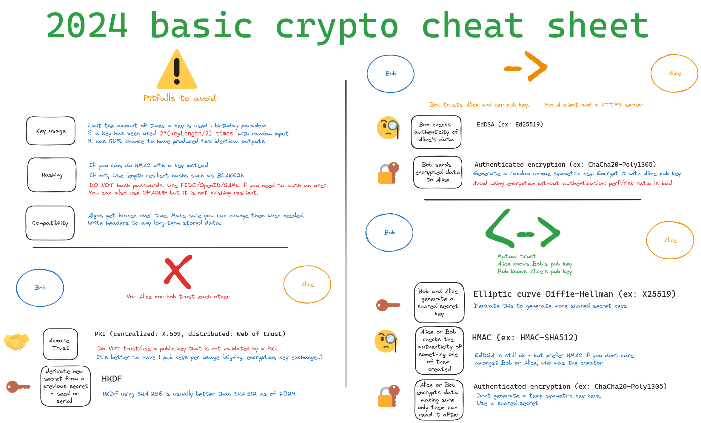

# Crypto cheat sheets

## Basic

### References

Terms used in the image:

- [X.509](https://en.wikipedia.org/wiki/X.509)
- [Web of trust](https://en.wikipedia.org/wiki/Web_of_trust)
- [HKDF](https://en.wikipedia.org/wiki/HKDF)
- [EdDSA](https://en.wikipedia.org/wiki/EdDSA)
- [Authenticated encryption](https://en.wikipedia.org/wiki/Authenticated_encryption)
- [ECDH](https://en.wikipedia.org/wiki/Elliptic-curve_Diffie%E2%80%93Hellman)
- [HMAC](https://en.wikipedia.org/wiki/HMAC)
- [Fido](https://fidoalliance.org/)
- [Open ID](https://fr.wikipedia.org/wiki/OpenID)
- [OPAQUE](https://blog.cloudflare.com/opaque-oblivious-passwords)

Other:

- [Libsodium](https://libsodium.gitbook.io/doc) a good library, cross platform, to do the crypto use-cases in the above image

# Advanced

More to come.

What topic would you like?

- zero knowledge ?
- hardware ?
- enclaves ?
- block chain ?
